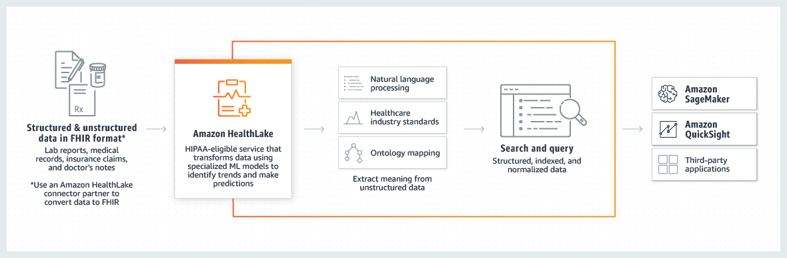

# AWS HEALTHLAKE

   

    

   
**Problem Statement**

For health data, it's common for it to be incomplete and inconsistent. Some examples of unstructured data(for example, heart ECG or brain EEG traces) are Clinical notes, lab reports, insurance claims, medical photographs, taped conversations, and time series. This information is intended for humans to grasp, but not for machines to comprehend.The following are the major obstacles to using healthcare data:
- How to gain a complete picture of the data by combining organized and
unstructured data?
- How do we evaluate the prediction findings intuitively?
- How do we automate digital transformation in healthcare?

**An overview of AWS Healthlake**

Amazon Healthlake is a HIPAA-eligible service that enables healthcare and life sciences companies to securely store data, transform it into a consistent, queryable format, and further analyze that data in the cloud on a petabyte-scale. The HealthLake API allows healthcare institutions to easily copy , such as medical image reports and patient notes,from on-premises systems to a secure data lake in the cloud.

**Pre-Requisites**
- AWS Management Console : It acts as a web interface that we can use to access HealthLake.
- AWS Command Line Interface (AWS CLI) : This helps in providing commands for a broad set of AWS services, including HealthLake, and is supported on Windows, macOS and Linux.
- AWS SDKs : Amazon Web Services provides SDKs (software development kits) that comprises of different libraries and sample code for various programming languages. Ultimately, it provides a convenient way to access HealthLake.
- Data Visualization Tools: Amazon Quicksight is used for building various business insights and predictions.

**Workflow**

Amazon Healthlake is broadly divided into four sections:
1. In the first section, a SageMaker notebook was created and a dummy patient population was generated using Synthea. Then, a HealthLake Data Store was created, the generated data was imported using Synthea and then it was exported to an S3 bucket.
2. In the second section, the exported data was transformed using Glue to extract the information added by HealthLake. For example, the Glue Job extracts the JSON Extension field and puts it in a separate table which can be used for building the dashboard.
3. In the third section, Athena was used for joining the individual tables into the required higher-level combined tables.
4. In the fourth section, Datasets were created in Quicksight and the QuickSight dashboard was built.

**Conclusion**

With the help of Machine Learning, organizations have been able to automate repetitive
manual processes leading to an increase in operational efficiency. Interactive dashboards
showcasing patient view and claims history were made for effective visualization, which
demonstrated how organizations can leverage the power of Machine Learning to achieve
speed and agility. The timeframe for certain significant analyses has been reduced to
days and hours as opposed to months, with the help of AWS tools like Amazon
HealthLake, Amazon SageMaker, Athena, and QuickSight. Amazon HealthLake with
other AWS services can be utilised by any healthcare providers, payers, and
pharmaceutical companies that operate in US East (N. Virginia), US East (Ohio), and
US West (Oregon) Regions. To provide better patient care, Amazon HealthLake has
been used with FHIR Works. A compliant FHIR data store can be created with
integrated NLP and analytics. AWS has partnered with Cognosante, Innovaccer, Redox,
InterSystems, Diameter Health, and HealthLX to deliver innovative and transformative
solutions to federal, state, and local governments.
****
- This code is part of the [Amazon HealthLake Workshop](https://amazon-healthlake.workshop.aws/). Please open that link for further instructions.
- For a detailed report, you can refer to this [link](https://pdfhost.io/v/RwmqHK~NO_Jyoti_Ranjan_Bhoi_AWS_HealthLake_Report)
